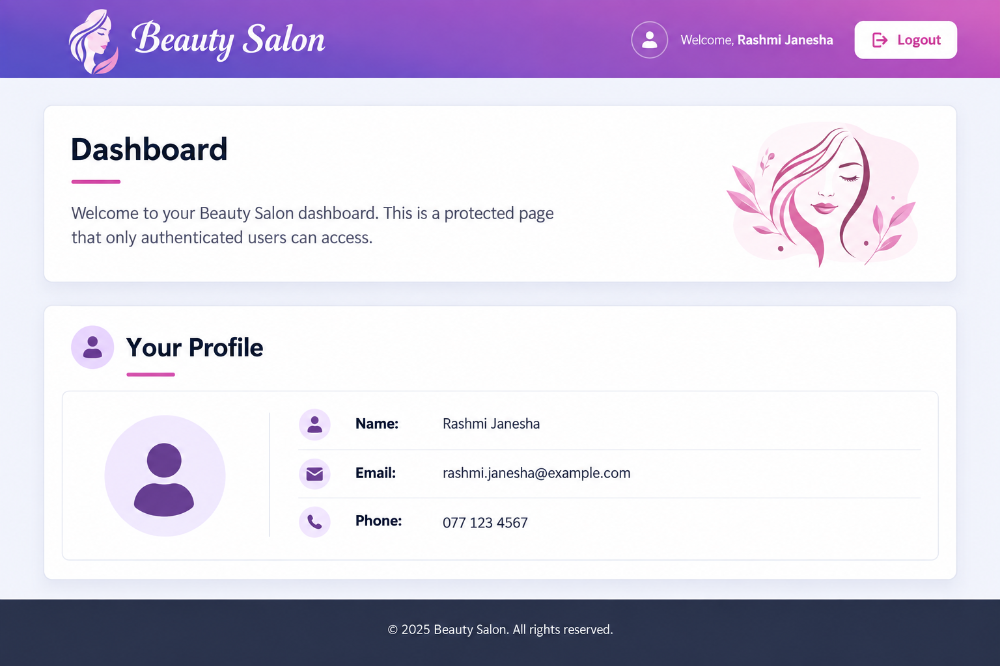
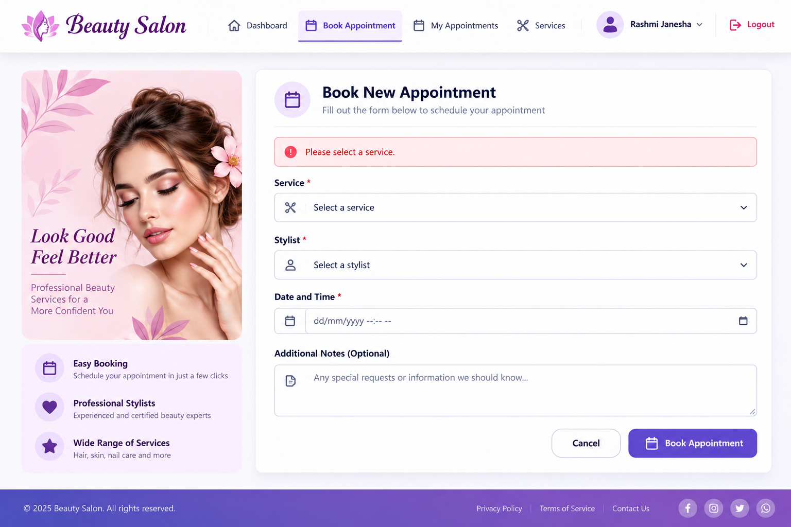
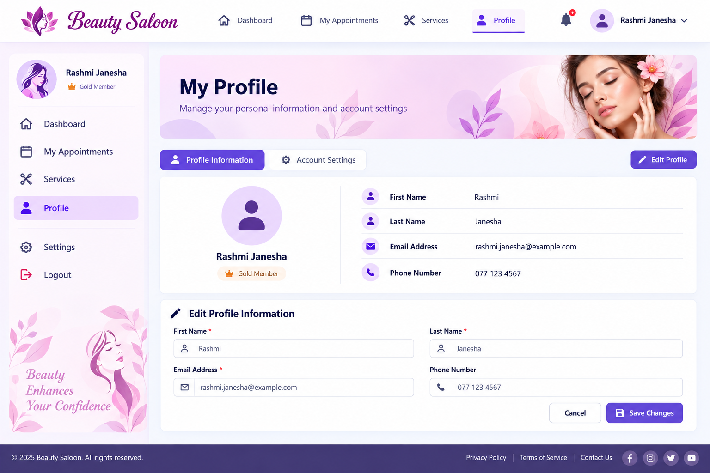
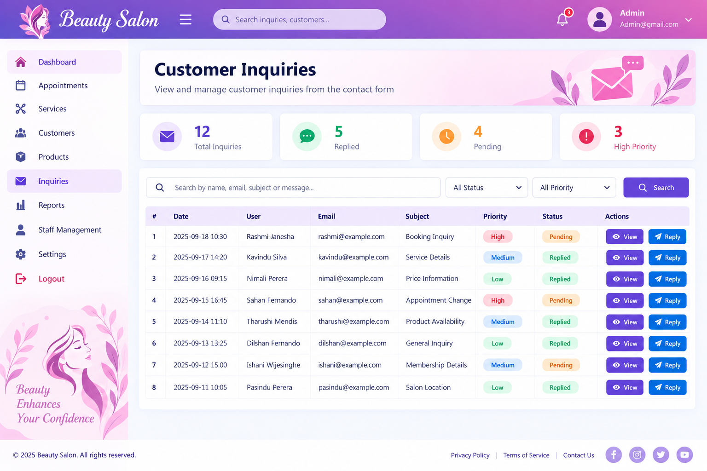

<h1>💇‍♀️ Beauty Salon Management System</h1>

<h3>✨ A Full-Stack Web Application for Modern Salon Management ✨</h3>

A user-friendly web-based system designed to simplify salon operations,
online appointments, customer management, services and administrative tasks.

 

  

 

---

## 📖 About the Project

---

## ✨ Key Features

### 👤 Customer Features

- 🔐 Create an account and log in to the system
- 💇 Browse available beauty salon services
- 💰 View service details and pricing
- 📅 Book salon appointments online
- 🗓️ Manage appointment bookings
- 💬 Send inquiries directly to the salon
- 📱 Access the system through a responsive web interface

### 🛡️ Administrator Features

- 📊 Access a centralized administration dashboard
- 👥 Manage customer records
- 📅 Manage and monitor appointments
- 💇 Add, update and remove salon services
- 🛍️ Manage salon products
- 💬 View and handle customer inquiries
- 📝 Update salon-related information
- ⚙️ Manage overall system operations

  ---

## 🛠️ Technology Stack

<table>
  <tr>
    <td><b>🎨 Frontend</b></td>
    <td>HTML5, CSS3, JavaScript, JSP</td>
  </tr>
  <tr>
    <td><b>⚙️ Backend</b></td>
    <td>Java, Java Servlets</td>
  </tr>
  <tr>
    <td><b>🗄️ Database</b></td>
    <td>MySQL</td>
  </tr>
  <tr>
    <td><b>🌐 Web Server</b></td>
    <td>Apache Tomcat</td>
  </tr>
  <tr>
    <td><b>🔄 Version Control</b></td>
    <td>Git & GitHub</td>
  </tr>
</table>

### 🔧 Core Technologies

  
  
  
  
  
  
  
  
  
  

---

## 📸 Application Screenshots

A preview of the main interfaces of the Beauty Salon Management System.

### 🏠 Customer Dashboard

  

 

### 📅 Appointment Booking

  

 

### 👤 Customer Profile

  

 

### 🛡️ Admin — Customer Inquiry Management

  

---

## ⚙️ Installation & Setup

### 📋 Prerequisites

Before running the project, make sure you have:

- ☕ Java JDK
- 🌐 Apache Tomcat
- 🗄️ MySQL Server
- 💻 Java IDE (IntelliJ IDEA, Eclipse, or NetBeans)
- 🔧 Git

---

## 📚 What I Learned

Through this project, I gained practical experience in:

- ☕ Java web application development
- 🌐 JSP and Java Servlets
- 🗄️ MySQL database integration
- 🔄 CRUD operations
- 🔐 User authentication and role-based functionality
- 📅 Appointment management systems
- 👤 Customer and administrator interfaces
- 🎨 Responsive web interface development
- 🐛 Debugging and problem solving
- 🔧 Git and GitHub version control

---

## 👩‍💻 Author

<h3>Rashmi Janesha</h3>

🎓 Undergraduate Computing Student 
🔐 Interested in Information Technology & Cybersecurity 
💻 Building and learning through practical projects

  

### ⭐ Support This Project

If you found this project interesting, consider giving the repository a ⭐.

 

<b>💻 Learn • 🛠️ Build • 🔐 Secure • 🚀 Grow</b>

  

<i>Thank you for visiting my project! 💙</i>

